# Kafka Stock Market Pipeline on AWS (EC2 + S3 + Glue Crawler + Athena)

> This project demonstrates a complete **end-to-end Kafka real-time data pipeline** on AWS. Kafka is deployed on **AWS EC2**, where producers and consumers (either local or remote) send and receive stock market data, which is then written to **Amazon S3**. The data is cataloged automatically using **AWS Glue Crawler** and queried using **Athena** for analysis.

---

## ✨ Features Overview

- Install and configure **Kafka 3.3.1** and **Java** on **AWS EC2**
- Set up **`advertised.listeners`** for public access to the Kafka broker  
- Start **ZooKeeper** and **Kafka Server**
- Create **Topics** and test using **Console Producer/Consumer**
- Use **Python Producer/Consumer** (via Jupyter Notebook) to stream data
- Write locally generated **stock-market-data** results to **S3** (CSV or Parquet)
- Use **AWS Glue Crawler** to automatically create tables from S3 data
- Query the resulting dataset with **Athena**, export results back to S3

---

## 🏗️ Architecture Diagram

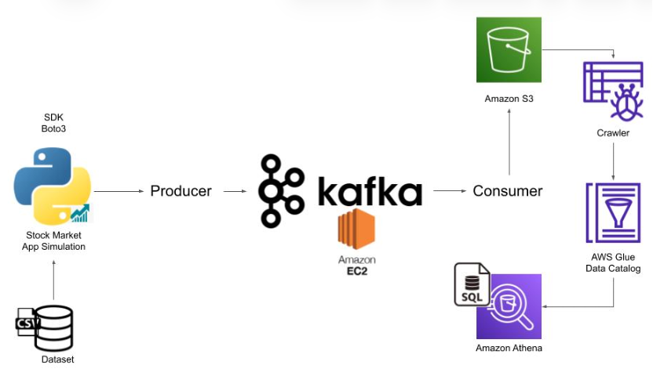

> Producers and consumers can run either on EC2 or locally, connecting to the Kafka broker via the EC2 public IP.

---

## 📁 Project Structure

```
command kafka.txt
indexProcessed.csv
kafka-consumer.ipynb
kafka-producer.ipynb
kafka-stock-market-project.pem
```

---

## ✅ Prerequisites

- An **AWS account**
- Basic understanding of **EC2 / S3 / IAM / Glue / Athena** services

---

## ☁️ Launch and Connect to AWS EC2

1. **Create an EC2 instance**
   - Recommended AMI: **Amazon Linux 2 (x86_64)**
   - Security Group inbound rules:
     - `SSH (22)` — from your public IP
     - `Custom TCP (9092)` — from your public IP (for Kafka access)

2. **Download your PEM key** (e.g. `kafka-stock-market-project.pem`) to a secure local directory.  
3. **Fix key permission (required by SSH):**
   ```bash
   chmod 400 kafka-stock-market-project.pem
   ```
4. **SSH into EC2** (replace with your instance address):
   ```bash
   ssh -i "kafka-stock-market-project.pem" ec2-user@ec2-XX-XX-XX-XX.compute-1.amazonaws.com
   ```

   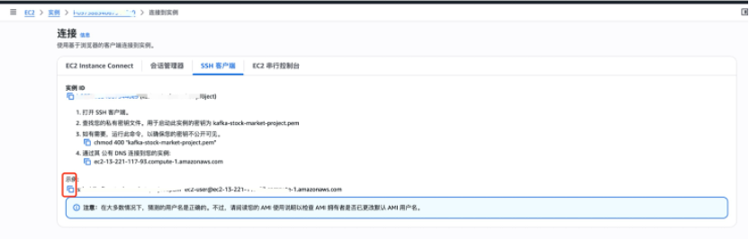

---

## 🔧 Install Java and Kafka on EC2

Once logged into EC2:

1. **Install Java 1.8 (OpenJDK)**
   ```bash
   java -version
   sudo yum install -y java-1.8.0-openjdk
   java -version
   ```

2. **Download and extract Kafka 3.3.1 (Scala 2.12)**
   ```bash
   wget https://archive.apache.org/dist/kafka/3.3.1/kafka_2.12-3.3.1.tgz
   tar -xvf kafka_2.12-3.3.1.tgz
   cd kafka_2.12-3.3.1
   ```

3. **Enable public access**
   ```bash
   sudo nano config/server.properties
   ```
   Add or modify the following lines:
   ```properties
   listeners=PLAINTEXT://0.0.0.0:9092
   advertised.listeners=PLAINTEXT://<EC2_PUBLIC_IP>:9092
   ```
   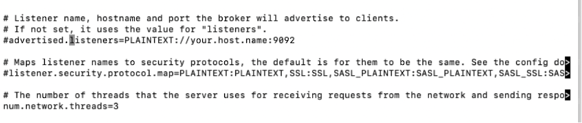
   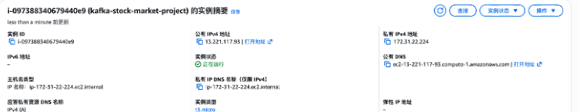

4. **Edit EC2 Security Group inbound rules**
   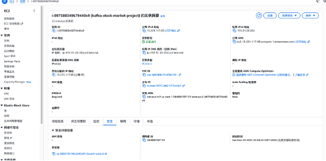
   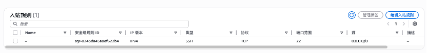
   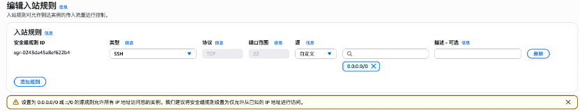
   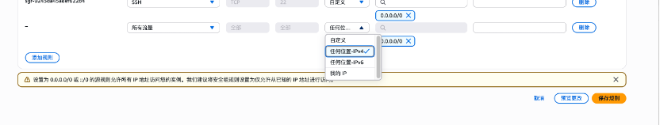

---

## ▶️ Start ZooKeeper and Kafka Server

Run these in **two separate terminals**:

**Terminal A: Start ZooKeeper**
```bash
cd ~/kafka_2.12-3.3.1
bin/zookeeper-server-start.sh config/zookeeper.properties
```

**Terminal B: Start Kafka Server**
```bash
cd ~/kafka_2.12-3.3.1
bin/kafka-server-start.sh config/server.properties
```

---

## 🧪 Create Topic and Test Communication

**Create Topic**
```bash
bin/kafka-topics.sh --create --topic demo_testing2   --bootstrap-server <EC2_PUBLIC_IP>:9092   --replication-factor 1 --partitions 1
```

**Start Producer**
```bash
bin/kafka-console-producer.sh --topic demo_testing2 --bootstrap-server <EC2_PUBLIC_IP>:9092
```

**Start Consumer**
```bash
bin/kafka-console-consumer.sh --topic demo_testing2 --bootstrap-server <EC2_PUBLIC_IP>:9092 --from-beginning
```

---

## 🐍 Python Integration with Kafka

**Install dependencies**
```bash
pip install kafka-python boto3 pandas
```

**Run Jupyter Notebooks**
- `kafka-producer.ipynb`: runs the producer and sends messages  
- `kafka-consumer.ipynb`: consumes messages and uploads results to S3  

Producer output can be viewed in the consumer terminal.
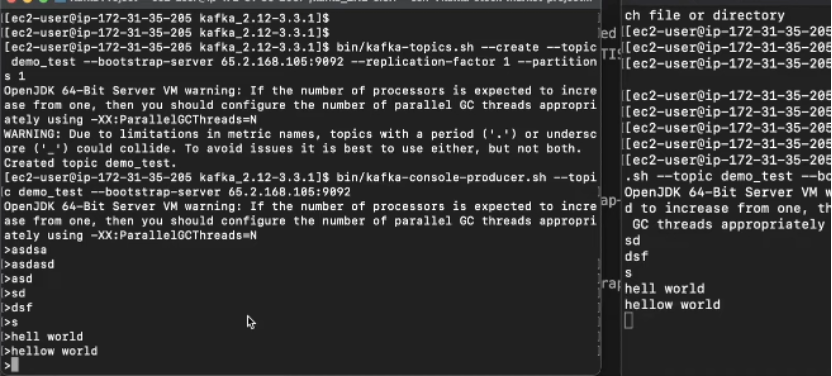
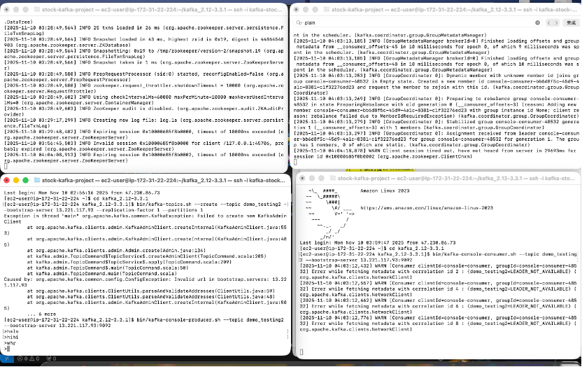

---

## ☁️ Write Data to S3

1. Create a new **S3 Bucket** to store Kafka consumer data.  
   
2. Create an **IAM User** and configure necessary permissions.  
   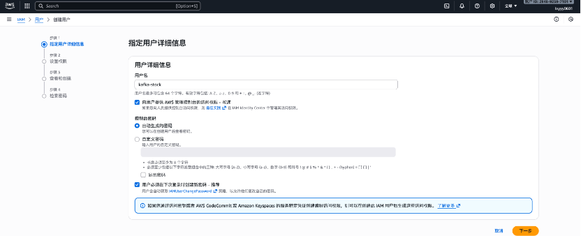
   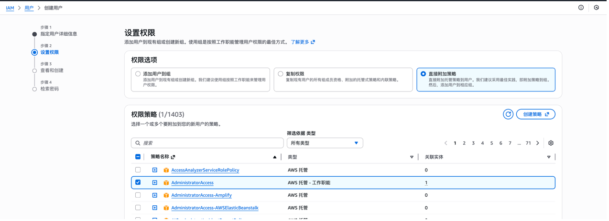
3. Configure AWS credentials locally (`aws configure`), then use **Boto3** to upload to S3.  
   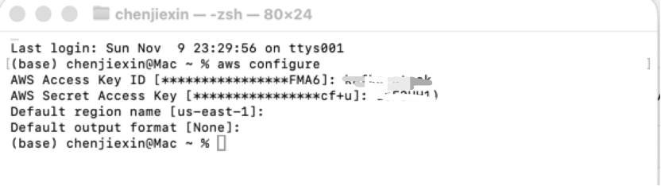

**Recommended execution order:**
1. Run `kafka-producer.ipynb` (simulate data stream)  
2. Run `kafka-consumer.ipynb` (consume and upload to S3)  

Result preview:  
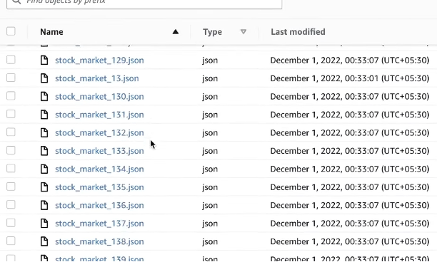

---

## 🕸️ Build Table with AWS Glue Crawler

1. Go to **AWS Glue → Crawlers → Create crawler**  
2. Select S3 as the data source (e.g. `s3://your-bucket/kafka-output/`)  
3. Assign or create an **IAM Role** with S3 read access  
4. Select or create a **Database** (e.g. `kafka_demo_db`)  
5. Run the crawler and review the generated table  

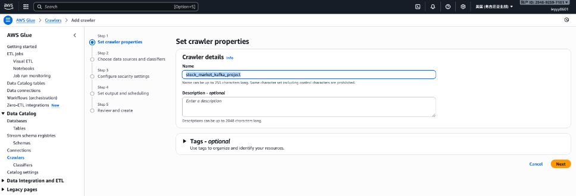
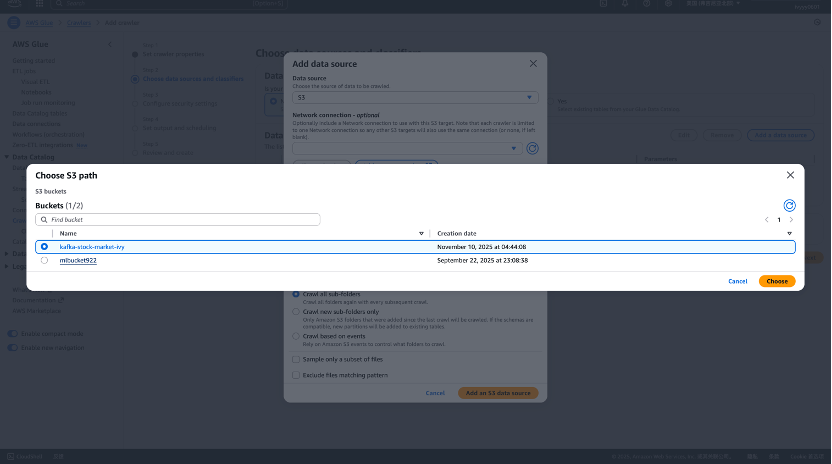
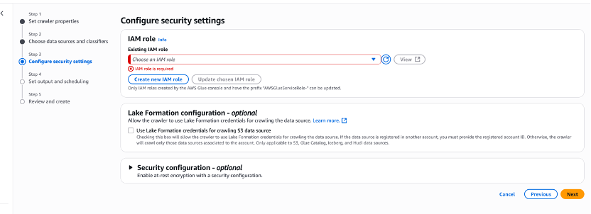
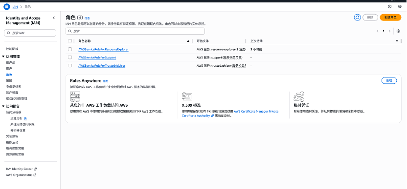
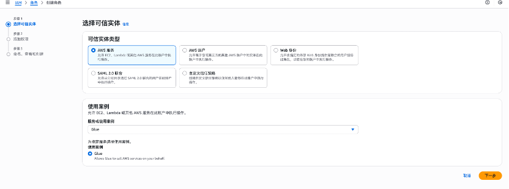
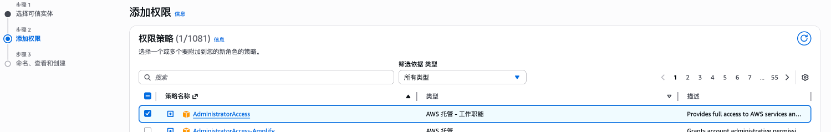
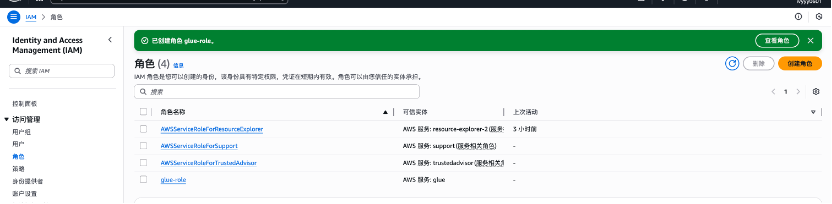
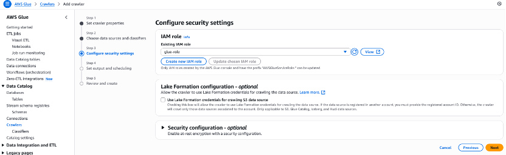

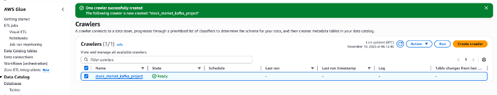

---

## 🔎 Query Data with Athena

1. Open **Athena**, confirm **Workgroup** and **Query result location** in **Settings**.  
2. In the left sidebar, find the Glue-generated database and tables.  
3. Example SQL query:
   ```sql
   SELECT * FROM kafka_demo_db.kafka_output_table LIMIT 20;
   ```
4. Query results and history are saved in S3.  

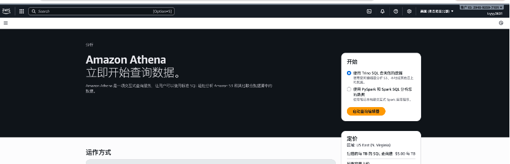
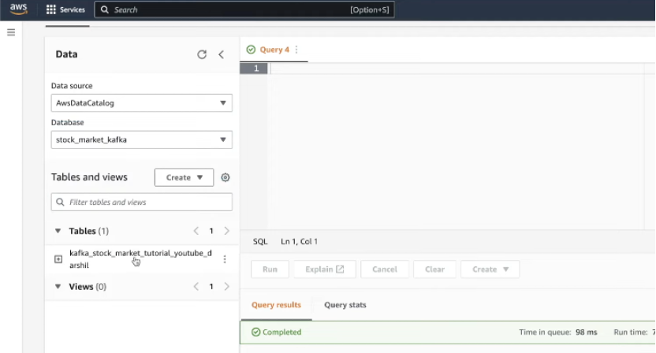
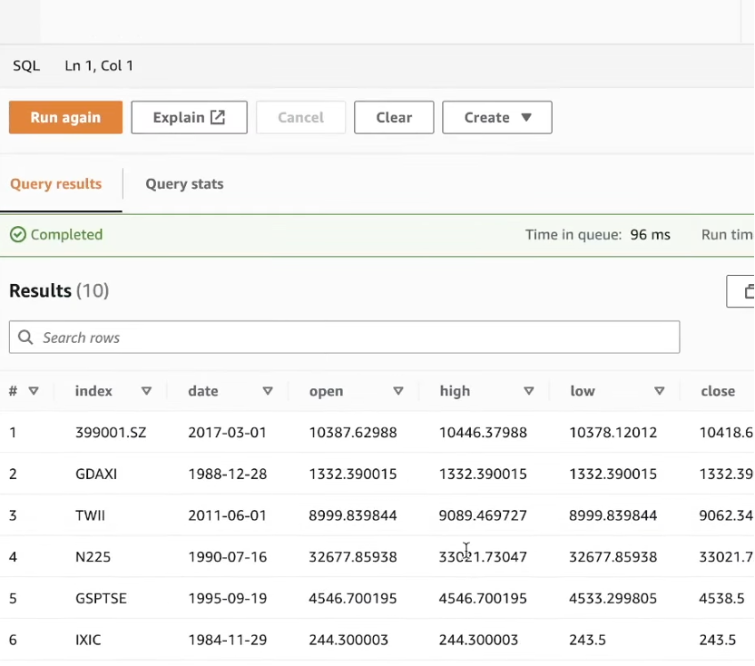
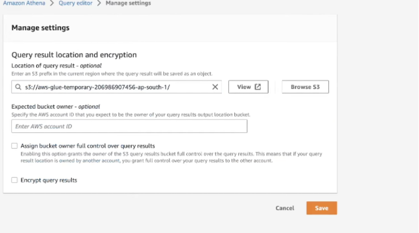

---

## 🧰 Troubleshooting

- **SSH: “Permissions are too open”** → Fix with `chmod 400 your.pem`
- **Kafka connection error**:
  - Check EC2 Security Group (port 9092 open)
  - Verify `advertised.listeners` is set to EC2 Public IP
  - Network/VPN may block connections
- **Kafka server startup failure**:
  - Ensure Java installed correctly
  - Check `logs/` folder for details
  - Verify port 9092 is not in use
- **No messages received**:
  - Verify topic names and IPs match
  - Add `--from-beginning` to consume all messages
- **S3 upload fails**:
  - Ensure IAM permissions and regions match
  - Prefer IAM Roles over plain credentials
- **Athena shows empty table**:
  - Ensure Glue Crawler points to the correct S3 prefix
  - Include header rows for CSV files

---

## 🧹 Cost Management and Cleanup

- Stop or terminate unused **EC2 instances**
- Delete test **S3 buckets/objects**
- Remove **Glue Crawler**, **Database**, and **Tables**
- Clear **Athena** output folders and deactivate unused workgroups

---

## ✅ Checklist

- [ ] EC2 Security Group allows ports 22 and 9092  
- [ ] `advertised.listeners` set to EC2 Public IP  
- [ ] ZooKeeper and Kafka running successfully  
- [ ] Producer/Consumer communication verified  
- [ ] Data uploaded to S3 successfully  
- [ ] Glue Crawler created table correctly  
- [ ] Athena queries produce valid results  

---

## 🔒 Security Notes

- Never commit PEM or AWS credentials to public repos  
- Restrict Security Group to your IP only  
- Close all public ports after testing  

---

> This README is ideal for demos, academic projects, or portfolio showcases. It provides a practical walkthrough of building an AWS-based Kafka streaming data pipeline end to end.
